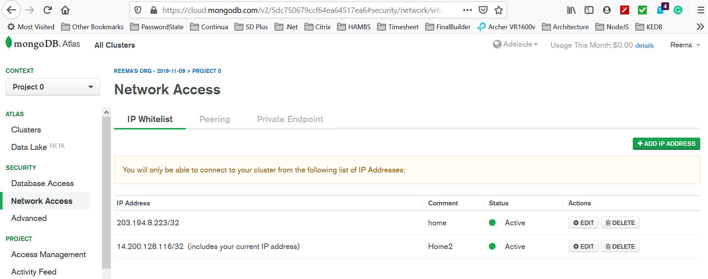
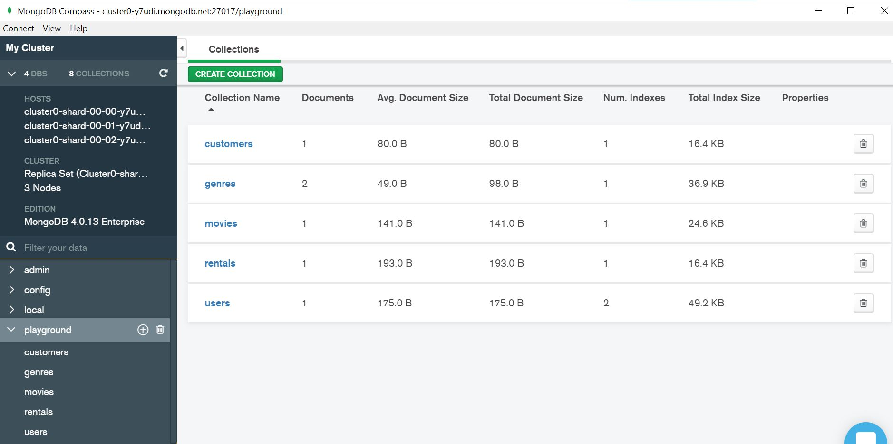
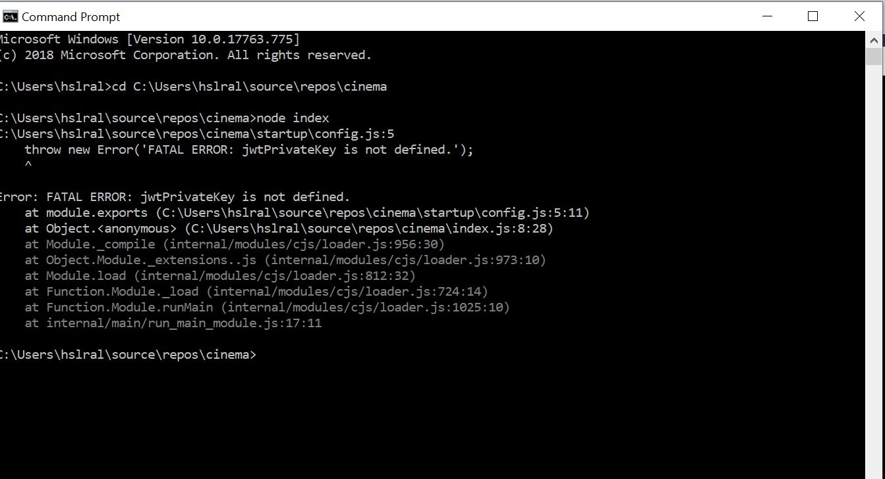
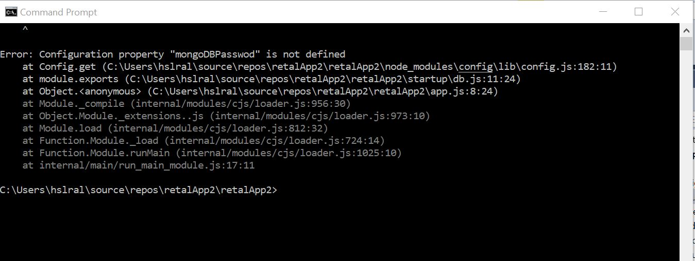
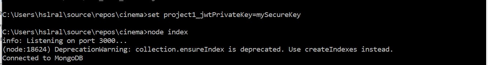
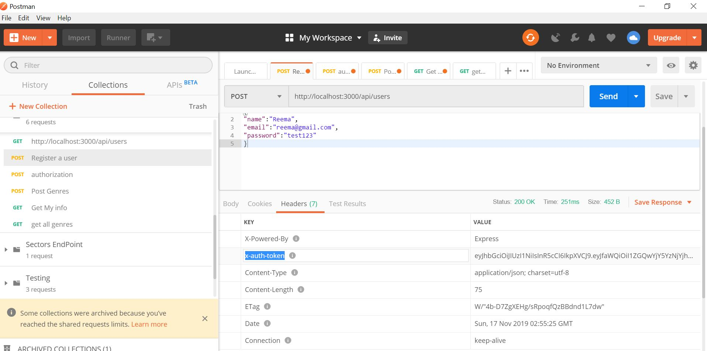
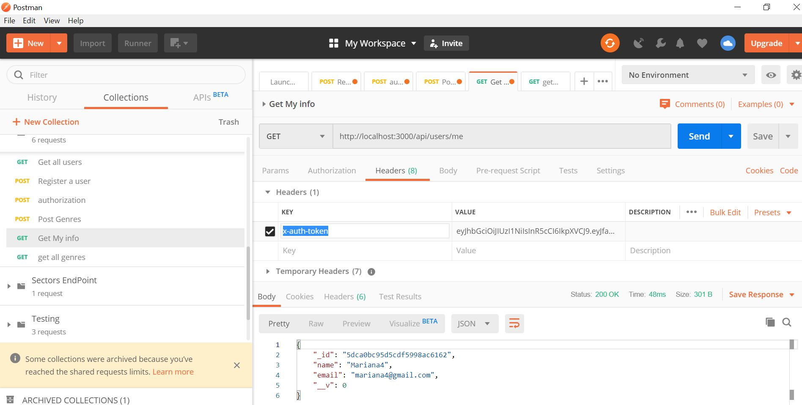
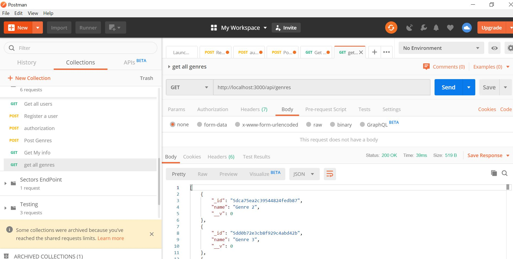
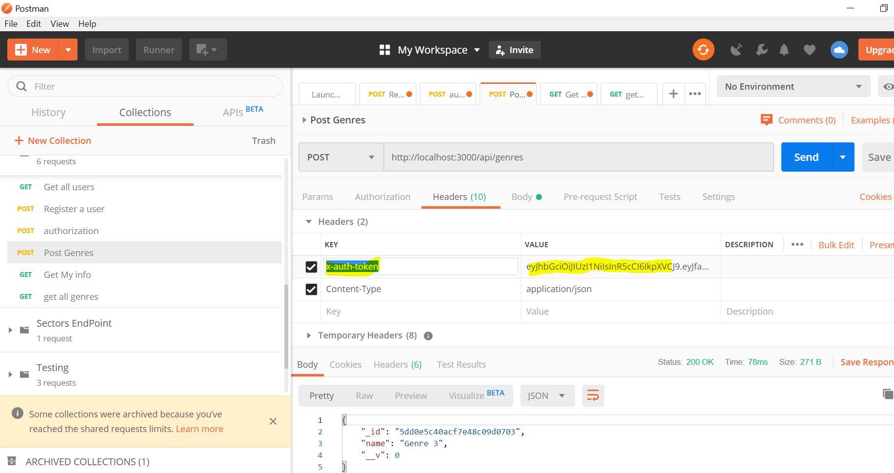
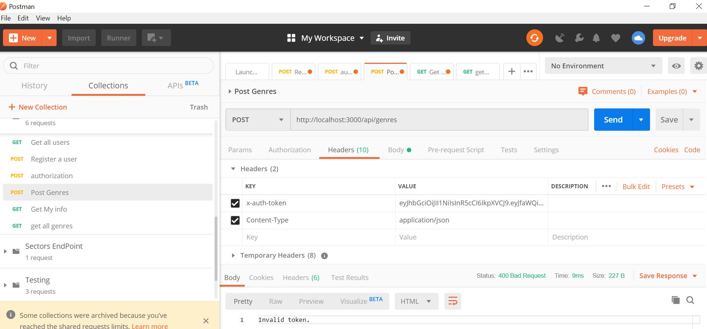

# Movies retalApp2

NodeJS APIs console application to rent movies to the customers using Restful APIs.

There are 5 API route handlers: users, genres, movies, customers, & rentals

## Techniques used
In this demo I have implemented the following techniques, but not limited to:

###	Authentication using JWT tokens and salt for password hashing.

You get the token as a response header in Post a user API endpoint. Then you can use this token as request header in other API Endpoints

###	Authorization strategies. 

Examples in  Genres route handler:

The list of all genres or by id does not need any authorization. Any user can list the genres

Only users with isAdmin=true can delete Genres…etc

To post a new Genre or update a current one, the user must be authenticated via a valid token in the header

###	Validation of user inputs
Using Joi library.

###	Express Framework
For different RESTFul API endpoints ( Post, Get, Put and Delete):  customers, genres, movies, rentals, users

###	CRUD 
To manipulate the database in the backend

###	Object oriented different concepts 
( classes, composition, denormalization…)

###	Async programming
 example, await ...

###	Error handling and logging mechanism
Using different libraries and also console

###	Secure passwords 
Using JSON config files to hide the passwords 

### Using middleware functions
Examples in the Genres route handler

I will email a created Postman collection which you can use it directly to test the APIs.

## Open-source Technologies used:
1- NodeJS backend server application. Needs to be installed on the server. If not, please download the "Recommended for most users" version and installed, from https://nodejs.org/en/ 

2- MongoDb database cluster on the cloud:https://cloud.mongodb.com/user?n=%2Fv2%2F5dc750679ccf64ea64517ea6&nextHash=%23clusters#/atlas/login

You must add your IP address to connect to pass the cluster AWS DB Firewall.
I will provide the username and password separately.

3- You can install MongoDB Compass as a client to view the database objects: https://www.mongodb.com/download-center/compass

This will allow a user interface to view and manipulate the "playground" database on the cloud.

4- Postman to consume and test the APIs. 

I will email Postman API collection to be used for testing

## Steps to run this APIs server application
1- Open command line of windows (cmd) and cd to the path where you cloned this project from Github.

2- type: node app

3- You should get the fatal error as explained below, to remind you to set jwtPrivateKey and dbPassword

This is intentionally done for security reason not to keep the token private key in any project config file.

All you need to do is to head to the path on cmd and type this command I am going to send by email for security reasons.
set project1_jwtPrivateKey= 

set rentalApp2_dbPassword=

I will email the jwtPrivateKey private key and the dbPassword separately
  
   
4- Once you set the environment variable of the private key password, re-run the application by:

type: node app

5- You should see a message saying running on port 3000.... 
 connected to MongoDB.
This means that the server is up and running.

## Details of the APIs endpoints and how to test them:
 you can use Postman to test the APIs

 There are 5 route handlers: users, genres, movies, customers, & rentals

 all body input should be provided in raw JSON format

 Example of how to test the different API endpoints 
1- Register a user: http://localhost:3000/api/users

Method: Post

Body:raw Jason 
{
"name":"Reema",
"email":"reema@gmail.com",
"password":"test123"
}

Response: on success is 200 with x-auth-token access token in the header as shown in the image below.

You can copy the token to use it as a request header to update/ post Genres

2- Get logged user info: http://localhost:3000/api/users/me

To get the logged user information without passing the ID in the URL. To avoid security hacking

Method: Get

Body: NA

Header: x-auth-token & a valid token value ( you can get it from the response header of the Register a new user)

Response:

On success, a JSON object of your information
{
    "_id": "5dca0bc95d5cdf5998ac6162",
    "name": "Mariana4",
    "email": "mariana4@gmail.com",
    "__v": 0
}

on failure: 400 Bad request, invalide token

3- Get all genres: http://localhost:3000/api/genres

It is for all visitors of the website thus, can be called without an authentication token.
Method: Get

Body: NA

Header: NA

Response: on success, JSON object of all Genres.

4- Post a new Genre:http://localhost:3000/api/genres

Only authenticated  users can add new Genres.

You need to pass a valid token to the header " x-auth-token" attribute when calling this API otherwise  will get error Access denied

Method: Post

Body: raw JSON object

{
	
	"name":"Genre 3"
	
}

Header: x-auth-token: ..and a valide token

Response:

200: New added Genres and the ID from the database 

400: Bad request in case invalid token passed.

