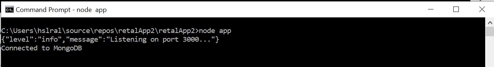
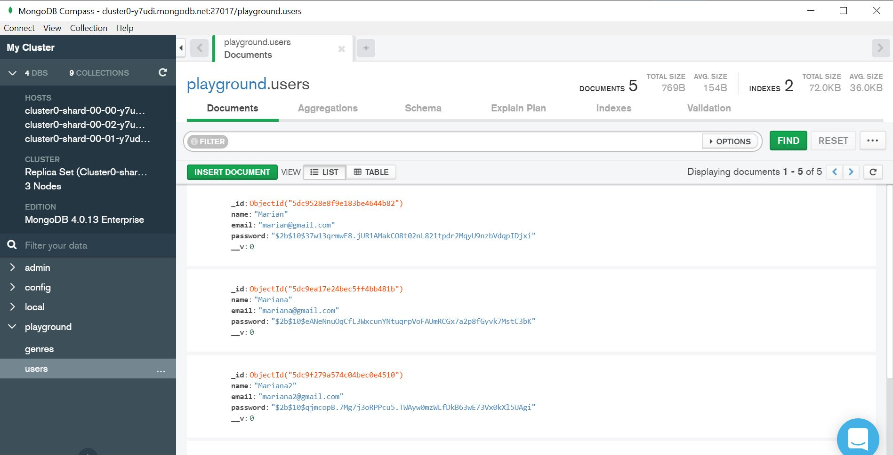

# retalApp2

NodeJS APIs console application to manage renting movies business using Restful APIs.

## Open-source Technologies used:
1- NodeJS backend server application

2- MongoDb database cluster on the cloud:https://cloud.mongodb.com/user?n=%2Fv2%2F5dc750679ccf64ea64517ea6&nextHash=%23clusters#/atlas/login

You must add your IP address to connect to pass the cluster AWS DB Firewall.
I will provide username and password separately.

3- You can install MongoDB Compass as a client to view the database objects: https://www.mongodb.com/download-center/compass

This will allow a user interface to ciew and manipulate the "playground" database on the cloud.

4- Postman to consume and test the APIs. 

I will email Postman API collection to be used for testing

## Prerequisites and steps to run this APIs application
1- NodeJS should be installed on your running machine. If not installed, head to: https://nodejs.org/en/ and download the "Recommended for most users"

2- Once NodeJS is istalled, open commandline and cd to the path where you cloned this project from Github.

3- You need to set jwtPrivateKey and dbPassword

otherwise, when you run the listener, you will get fatal error as explained below

type: node app and press Enter Key

 Most propbley, you will get : "FATAL ERROR" jwtPrivateKey is not defined.

 This is intionally done to for security reason not to keep the token private key in any project config file.
All you need to do is to head to the path on cmd and type this command I am going to send by email for security reasons.
set project1_jwtPrivateKey= 

I will email the jwtPrivateKey private key separately
  

===========================
set rentalApp2_dbPassword

4- Once you set the environment variable of the private key password, re run the applicaion by:

type: node app

5- You should see a message saying running on port 3000.... 
 connected to MongoDB.
This mean the server is up and running.

## MongoDB on the cloud:

1- You don't need to install the DB as it is already on the cloud: path: 

2- If you want an interface to log on the DB on the clound see the updates when calling the APIs, 
you can download MongoDB Compass Communicy Eddition: https://docs.mongodb.com/manual/administration/install-community/

I will email the user name and password separatelly

## Details of the APIs endpoints and how to test them:
 Postman to test the APIs

 There are 5 route handlers: users, genres, movies, customers, & rentals
 
1- Register a user: http://localhost:3000/api/users

Method: Post

Body:raw Jason 
{
"name":"Reema",
"email":"reema@gmail.com",
"password":"test123"
}

Response: on success is 200 with x-auth-token access token in the header as shown in the image below.

2- Get logged user info: http://localhost:3000/api/users/me

To get the logged user information without passing the ID in the URL. To avoid security hacking

Method: Get

Body: NA

Header: x-auth-token & a valide token value ( you can get it from the response header of the Register a new user)

Response:

On success, a JSON object of your information
{
    "_id": "5dca0bc95d5cdf5998ac6162",
    "name": "Mariana4",
    "email": "mariana4@gmail.com",
    "__v": 0
}

on failure: 400 Bad request, invalide token

3- Get all genres: http://localhost:3000/api/genres

It is for all visitors of the website thus, can be called withouth authontication token.
Method: Get

Body: NA

Header: NA

Response: on success, JSON object of all Genres.

4- Post a new Genre:http://localhost:3000/api/genres

Only authonticated users can add new Genres.

You need to pass a valid toked to the header " x-auth-token" attribute when calling this API aotherwhise will get errer Access denied

Method: Post

Body: rway JSON object

{
	
	"name":"Genre 3"
	
}

Header: x-auth-token: ..and a valide token

Response:

200: New added Genres and the ID from the database 

400: Bad request in case invalid token passed.

